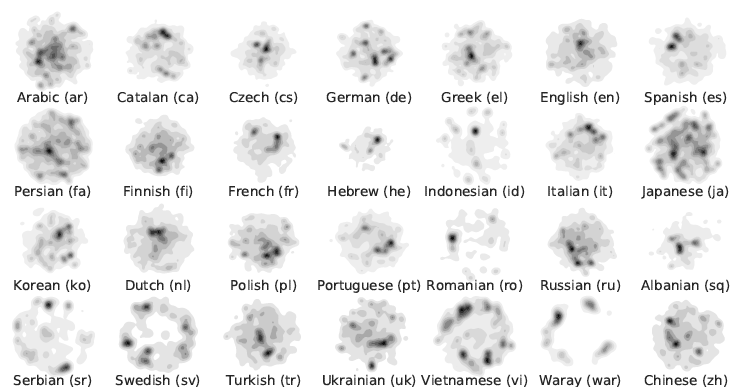
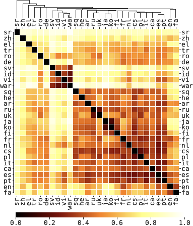

# Crosslingual Topic Modeling with WikiPDA

_Tiziano Piccardi, Robert West_

We present Wikipedia-based Polyglot Dirichlet Allocation (_WikiPDA_), a crosslingual topic model that learns to represent Wikipedia articles written in any language as distributions over a common set of language-independent topics. It leverages the fact that Wikipedia articles link to each other and are mapped to concepts in the Wikidata knowledge base, such that, when represented as bags of links, articles are inherently language-independent. WikiPDA works in two steps, by first densifying bags of links using matrix completion and then training a standard monolingual topic model. A human evaluation shows that WikiPDA produces more coherent topics than monolingual text-based LDA, thus offering crosslinguality at no cost. We demonstrate WikiPDA’s utility in two applications: a study of topical biases in 28 Wikipedia editions, and crosslingual supervised classification. Finally, we highlight WikiPDA’s capacity for zero-shot language transfer, where a model is reused for new languages without any fine-tuning.

Full paper: [https://arxiv.org/abs/2009.11207](https://arxiv.org/abs/2009.11207)

## Content of this repository:

* [PaperAndCode](PaperAndCode): This folder contains the original PySpark code to reproduce the results and the Jupyter notebooks used for the analyses described in the paper.

* [WikiPDA-Lib](WikiPDA-Lib): Python library for WikiPDA. It allows you  to generate a topic distribution by using one of the pretrained LDA models, and predict the topics with the pretrained supervised model.

* [WikiPDA-HTTP-API](WikiPDA-HTTP-API): HTTP API that produces cross-lingual topic embeddings using WikiPDA. The goal of the API is to provide an easy way to get a feel for the technique without having to install the libraries. 

Credits for WikiPDA-Lib and WikiPDA-HTTP-API: [DanielBergThomsen](https://github.com/DanielBergThomsen)

## What can I do with WikiPDA?

WikiPDA gives you a language-agnostic distribution over K topics generated with LDA. The process is unsupervised, and it allows you to discover the subjects more covered in different languages, compute the topics distance between Wikipedia editions, or get a topics vector that can be used as an input for a supervised task.

Few examples:

Examine the density of topics in different languages:

Compute the topical distance between different Wikipedia editions:

Check the paper for more use cases: [https://arxiv.org/abs/2009.11207](https://arxiv.org/abs/2009.11207)